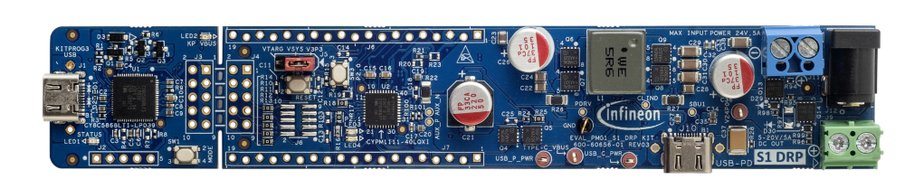

# EVAL_PMG1_S1_DRP BSP

## Overview

The EVAL_PMG1_S1_DRP Prototyping Kit is a development platform that enables the design and development of EZ-PD™ PMG1-S1 (CYPM1111-40LQXIT) based  embedded USB-C Power Delivery (PD) products which can provide/consume a high voltage power to/from USB PD port.

To use code from the BSP, simply include a reference to `cybsp.h`.

## Features

### Kit Features:

* Supports USB PD DRP operation on the USB-C port.
* Supports SPR (Standard Power Range) up to 100W (20V, 5A) of power consumption as both source and sink.
* Kit can be powered from either an external DC adapter (24V) or from USB-C Bus power.
* KitProg3 based programming and debug interface.
* Access to the pins of PMG1-S1 silicon (CYPM1111-40LQXIT) in hardware and support for BSP, PDL and Middleware in Modus Toolbox.
* The kit can provide two fixed voltage supplies - 5V/2.5A and 3.3V/400mA to enable customers to power external peripherals/sensors if required.

### Kit Contents:

* EZ-PD™ CYPM1111-40LQXIT based board
* Quick Start Guide

## BSP Configuration

The BSP has a few hooks that allow its behavior to be configured. Some of these items are enabled by default while others must be explicitly enabled. Items enabled by default are specified in the EVAL_PMG1_S1_DRP.mk file. The items that are enabled can be changed by creating a custom BSP or by editing the application makefile.

Components:
* Device specific category reference (e.g.: CAT1) - This component, enabled by default, pulls in any device specific code for this board.

Defines:
* CYBSP_CUSTOM_SYSCLK_PM_CALLBACK - This define, disabled by default, causes the BSP to skip registering its default SysClk Power Management callback, if any, and instead to invoke the application-defined function `cybsp_register_custom_sysclk_pm_callback` to register an application-specific callback.

### Clock Configuration

| Clock    | Source    | Output Frequency |
|----------|-----------|------------------|
| CLK_HF   | CLK_IMO   | 48 MHz           |

### Power Configuration

* System Idle Power Mode: Deep Sleep
* VDDA Voltage: 3300 mV
* VDDD Voltage: 3300 mV

See the [BSP Setttings][settings] for additional board specific configuration settings.

## API Reference Manual

The EVAL_PMG1_S1_DRP Board Support Package provides a set of APIs to configure, initialize and use the board resources.

See the [BSP API Reference Manual][api] for the complete list of the provided interfaces.

## More information
* [EVAL_PMG1_S1_DRP BSP API Reference Manual][api]
* [EVAL_PMG1_S1_DRP Documentation](https://www.infineon.com/EVAL_PMG1_S1_DRP)
* [Cypress Semiconductor, an Infineon Technologies Company](http://www.cypress.com)
* [Infineon GitHub](https://github.com/infineon)
* [ModusToolbox™](https://www.cypress.com/products/modustoolbox-software-environment)

[api]: https://infineon.github.io/TARGET_EVAL_PMG1_S1_DRP/html/modules.html
[settings]: https://infineon.github.io/TARGET_EVAL_PMG1_S1_DRP/html/md_bsp_settings.html

---
© Cypress Semiconductor Corporation (an Infineon company) or an affiliate of Cypress Semiconductor Corporation, 2024.